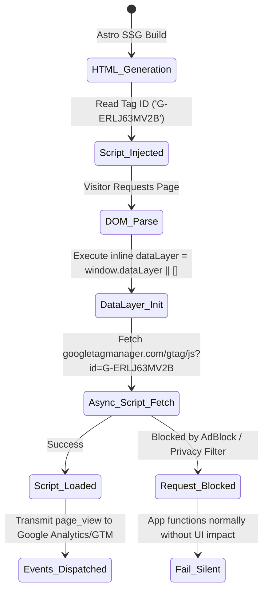

# Data Model: Google Tag Manager Integration

## Component & Configuration Schema

### 1. Analytics Tag Configuration (`TagManagerConfig`)

Represents the configuration parameters used to initialize the tracking container across the site layouts.

| Field | Type | Required | Default Value | Description |
| --- | --- | --- | --- | --- |
| `id` | `string` | Yes | `'G-ERLJ63MV2B'` | Google Tag / GTM measurement container ID. Sourced from `import.meta.env.PUBLIC_GTM_ID` or fallback constant. |
| `enabled` | `boolean` | Optional | `true` | Controls whether tag scripts are injected into pre-rendered HTML. |
| `debug` | `boolean` | Optional | `false` | Enables verbose console logging for dataLayer events when set to true in dev environments. |

---

### 2. Global Window DataLayer Entity (`Window.dataLayer`)

Represents the client-side event array maintained in browser memory for tracking events.

| Property | Type | Description |
| --- | --- | --- |
| `dataLayer` | `Array<IArguments \| Record<string, any>>` | Global JavaScript array created on `window` to queue analytics calls before and after script loading. |

#### Data Layer Event Payload Structure

```json
{
  "event": "page_view",
  "page_location": "https://astrologyforthefuture.com/es/about",
  "page_title": "Sobre Nosotros | Astrology for the Future",
  "language": "es"
}
```

---

## State & Lifecycle Flow


